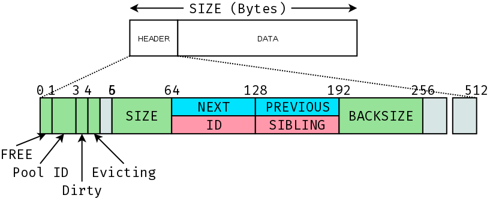

# Blocks

## Field Descriptions

### Bit Fields

For optimal data movement purposes, the minimum possible granularity allocation granularity is a cache line size (64B).
In practice, this is usually much higher (i.e. 4k or 2/4MiB), but the 64B constraint holds in the context of a memory block.
This, therefore, gives us 6 free bits at the bottom of the `size` field to store some metadata.
The meaning of these bits is summarized here.

| Name     | Bits | Description |
| -------- | ---- | :---------- |
| Free     | 0    | 1 if the memory segment described by thie block is free. 0 if this block is not free |
| Pool ID  | 1-2  | Indicates the memory pool this block belongs to. `00 -> DRAM`, `01 -> PMM`, `10,11 -> Reserved`. |
| Dirty    | 3    | 1 if `data` segment is dirty, 0 if `data` is clean. This should be set/cleared by higher levels in the cache management system. |
| Evicting | 4    | This bit is used when a block is freed. Under normal freeing, this bit is set to 0 and this block is returned to the heap as normal (i.e., potentially merged with neighboring blocks, freelists updated etc.). However, if a block is being freed as a result of a forced eviction, we want to bypass the normal freeing logic and just mark the block as free. Setting this bit to 1 achieves that. |

### Always Valid Fields

The following fields should always be valid for a block, whether it is free or not.

| Name  | Bytes | Description |
| ----- | ----- | :---------- |
| Size  | 0-7 (mask off lower 6 bits) | The total size in bytes of the block header plus data. The next block in the heap can be accessed by stepping `size` bytes from the block pointer. |
| Backsize | 24-31 | The size of the memory block immediately before this block. Used to check if the previous block is free to facilitate block merging. |

### Valid while Free

The following fields are valid while the block is free.

| Name  | Bytes | Description |
| ----- | ----- | :---------- |
| Next  | 8-15  | Pointer to the next block in a freelist. If this block is the last block in a freelist, this pointer will be null. |
| Previous | 16-23 | Pointer to the previous block in a freelist. If this block is the first block in a freelist, this pointer will be null. |

### Valid while Not-Free

The following fields are valid while the block is free.

| Name  | Bytes | Description |
| ----- | ----- | :---------- |
| ID    | 8-15  | Unique ID assigned to this block by the cache manager. This is used to associate blocks in different memory pools. Blocks with the same ID are called `siblings` and represent the same array. |
| Sibling | 16-23 | Pointer to a sibling block for the current block. If a block does not have a sibling, this will be null. Siblings are created, for example, when a block is fetched from `PMM` to `DRAM`. In this scenario, a block is allocated in `DRAM` and data is copied from the `PMM` block into the `DRAM` block. The blocks are then configured to be eachother's siblings. Thus, if the `DRAM` block is modified, the `PMM` block can be updated. |

